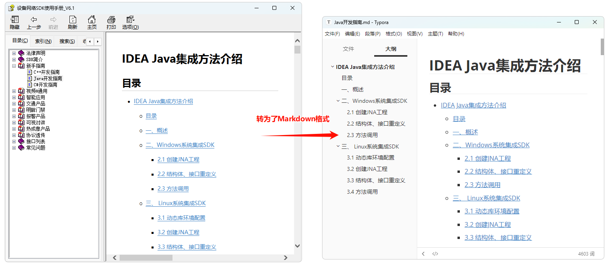

### 设备网络 SDK 使用手册：CHM → HTML → Markdown 转换工具



#### 一、环境准备

- 系统：Windows（需要系统自带的 `hh.exe`）
- 已安装：
  - Python 3.10+
  - `uv` 包管理器（命令行可运行 `uv`）

在项目根目录（本仓库目录）执行以下命令前，请先进入目录：

```bash
cd C:\Users\cheng\Downloads\设备网络SDK使用手册_20240802154136
```

#### 二、CHM 解包为 HTML

1. 默认解包到 `html` 目录：

```bash
uv run python chm_to_html.py "设备网络SDK使用手册.chm"
```

2. 自定义输出目录（例如 `out_html`）：

```bash
uv run python chm_to_html.py "设备网络SDK使用手册.chm" -o out_html
```

运行完成后，对应目录下会出现大量 `.html` 文件（原 CHM 内容）。

#### 三、HTML 批量转换为 Markdown

1. 使用默认 HTML 根目录 `html`：

```bash
uv run python html_to_md.py
```

2. 指定 HTML 根目录（配合 `-o out_html` 使用）：

```bash
uv run python html_to_md.py --root out_html
```

3. 只转换某个子目录（相对根目录）：

```bash
uv run python html_to_md.py --root out_html --subdir 结构体
uv run python html_to_md.py --root out_html --subdir "00新手指南"
```

4. 将 Markdown 输出到单独目录（与 HTML 分开存放），例如输出到 `out_md`：

```bash
uv run python html_to_md.py --root out_html --out-root out_md
uv run python html_to_md.py --root out_html --out-root out_md --subdir 结构体
```

转换完成后，会在指定输出目录下，以相同目录结构生成对应的 `.md` 文件，例如：

- `out_html\结构体\国家和地区编号.html` → `out_md\结构体\国家和地区编号.md`

#### 四、注意事项

- Markdown 文件统一以 UTF-8 编码写出，尽量避免中文乱码。
- 脚本可重复执行，已存在的 `.md` 会被覆盖更新。
- 如果发现个别页面仍有乱码或格式问题，可记录对应 `.html/.md` 路径，进一步调整转换规则。
